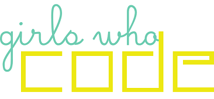
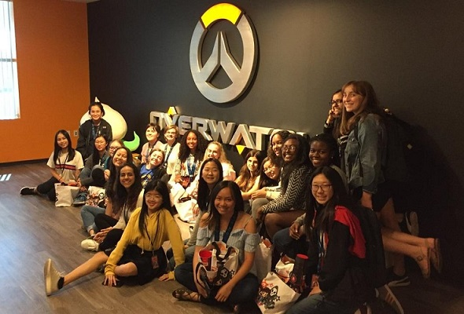

    

# Girls Who Code Summer Immersion Program 2018 -- Blizzard Entertainment Classroom

## Teaching Staff

**Teacher**: Mimi Chen

**TA**: Akshita Nathani

**TA**: Sandy Tsan

------------------------------------
## Repository

This repository is composed of code from activities and projects done in the GWC SIP Blizzard classroom.

Unit 1: [Python](./Python)

Unit 2.1: [Robotics](./Robotics)

Unit 2.2: [Web Development](./WebDev)

